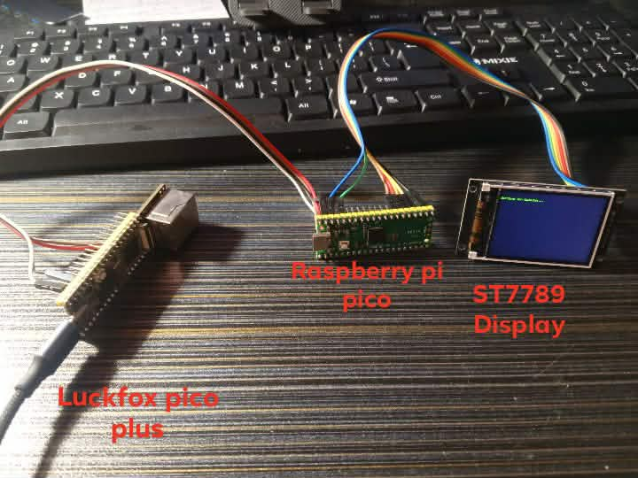
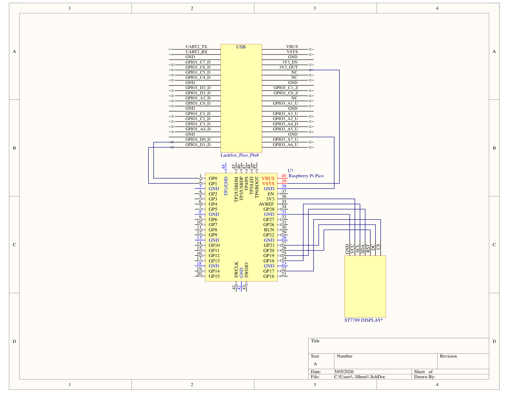
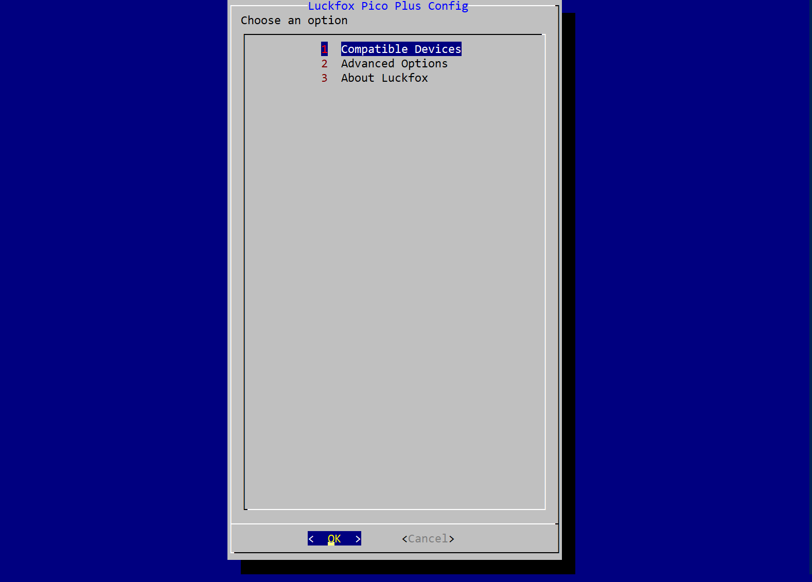
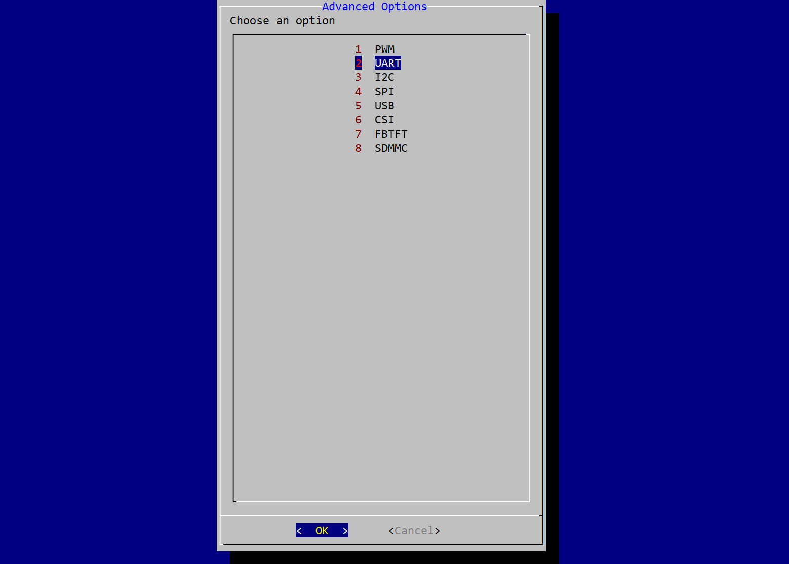
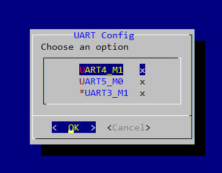
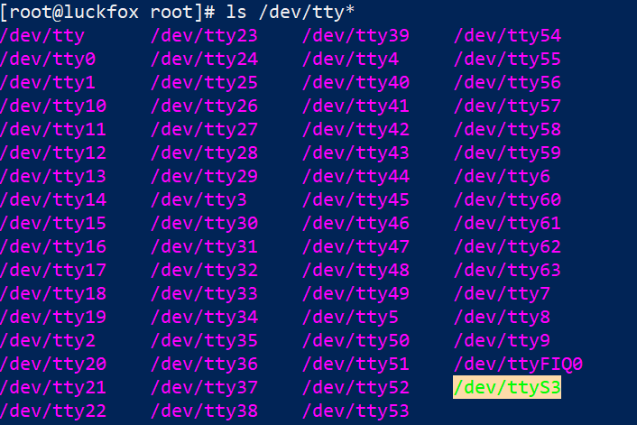
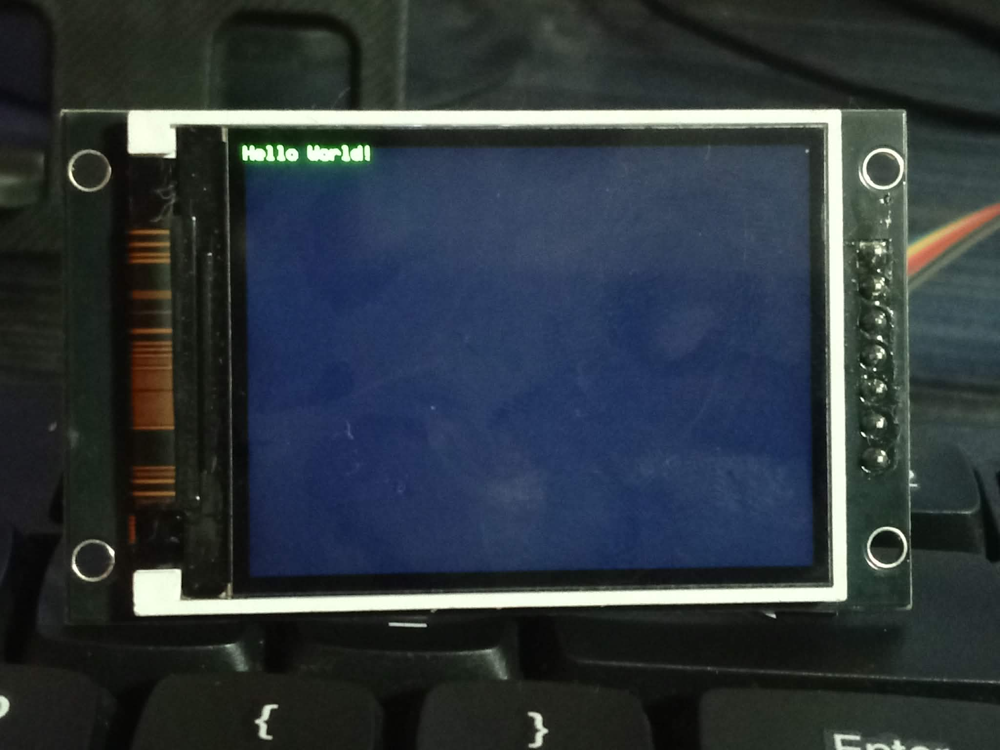
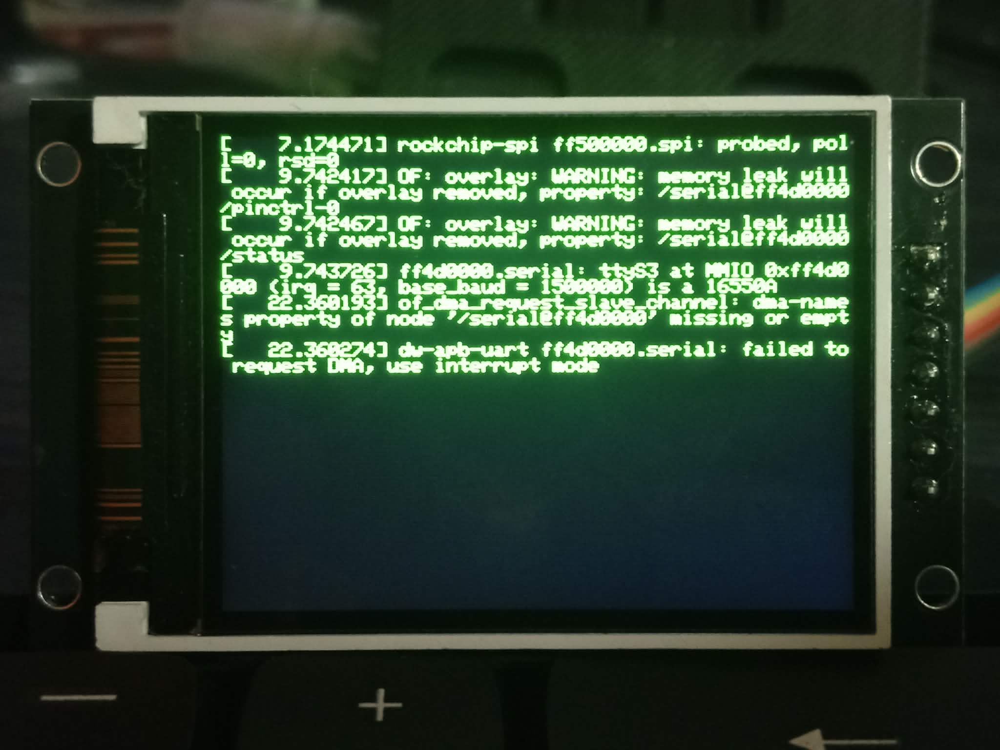

# Luckfox Pico Plus Cyberdeck Ver. 0.0.1 (LP+ Cyberdeck)

## About

The Luckfox Pico Plus Cyberdeck, or LP+ Cyberdeck for short, is a cyberdeck built around the Luckfox Pico Plus and utilizing the Raspberry Pi Pico as a serial based display driver for the ST7789 TFT Display. The Luckfox pico plus communicates with the Raspberry Pi Pico via UART protocol.


## Preview



---

## Features

- Serial terminal display (UART)
- ST7789 graphical display (Minimal)

---

## Hardware Used:

Main components:

- Luckfox Pico Plus (RV1103)
- Raspberry Pi Pico (RP2040)
- ST7789 (Specifically 2.0TFTSPI GMTO20-02-7P 240x320 Display or you could use other models but you would have to change the code)

---

## Wiring



### Luckfox → Pico

| Luckfox (UART3) | Pico  |
|---------|------|
| TX (UART3_TX_M1) | RX (GP1) |
| RX (UART3_RX_M1) | TX (GP0) |
| GND | GND |

### Pico → ST7789

| Pico | Display |
|------|---------|
| GP18 | SCK/SCL |
| GP19 | SDA |
| GP17 | CS |
| GP21 | DC |
| GP20 | RST |
| 3V3 | VCC |
| GND | GND |

---

## Software

### Image for Cyberdeck

- Buildroot (Default Buildroot Image for Luckfox Pico Plus)

### Flash tools:

- Arduino IDE (To flash Raspberry Pi Pico Display Driver)
- RKFlash (For Linux Environments)
- SocToolKit (For Windows Environment)

### Dependencies: (For flashing firmware to Raspberry Pi)

```cpp
<SPI.h>
<Adafruit_GFX.h>
<Adafruit_ST7789.h>
```

### Building Custom Images:

Refer to: https://github.com/LuckfoxTECH/luckfox-pico

---

## Installation

### Installation A

To flash the Raspberry Pi Pico Serial Display. You`ll need:

- Arduino IDE
- RPi Pico Source Code

Steps:

1. Download the source code in '/src/pico-serial-display.ino'

2. Open the '.ino' using the Arduino IDE.

3. Make sure you have RPi Pico Board and Libraries installed.

4. Flash the code!

---

### Installation B

To flash the Luckfox Pico Image refer to https://wiki.luckfox.com/Luckfox-Pico-Plus-Mini/Flash-image

## Usage

### Usage A

Run

```bash
ls /dev/tty*
```
to locate all serial interfaces **(specially ttyS3)**

```bash
[root@luckfox root]# ls /dev/tty*
/dev/tty      /dev/tty29    /dev/tty5
/dev/tty0     /dev/tty3     /dev/tty50
/dev/tty1     /dev/tty30    /dev/tty51
/dev/tty10    /dev/tty31    /dev/tty52
/dev/tty11    /dev/tty32    /dev/tty53
/dev/tty12    /dev/tty33    /dev/tty54
/dev/tty13    /dev/tty34    /dev/tty55
/dev/tty14    /dev/tty35    /dev/tty56
/dev/tty15    /dev/tty36    /dev/tty57
/dev/tty16    /dev/tty37    /dev/tty58
/dev/tty17    /dev/tty38    /dev/tty59
/dev/tty18    /dev/tty39    /dev/tty6
/dev/tty19    /dev/tty4     /dev/tty60
/dev/tty2     /dev/tty40    /dev/tty61
/dev/tty20    /dev/tty41    /dev/tty62
/dev/tty21    /dev/tty42    /dev/tty63
/dev/tty22    /dev/tty43    /dev/tty7
/dev/tty23    /dev/tty44    /dev/tty8
/dev/tty24    /dev/tty45    /dev/tty9
/dev/tty25    /dev/tty46    /dev/ttyFIQ0
/dev/tty26    /dev/tty47    /dev/ttyS3
/dev/tty27    /dev/tty48
/dev/tty28    /dev/tty49
```

- Find **/dev/ttyS3**. If not found enable it from the ***luckfox-config tool.***

## Enabling UART3 (if not yet enabled)

Type in terminal 

```bash
luckfox-config
```



Then select number 2 **(Advanced Options)**

After that navigate to 2 **(UART)**



Then from there activate **UART3_M1**



After activating. Re-Run the command:

```bash
ls /dev/tty*
```

After activating **UART3_M1**, you will see **/dev/ttyS3**



---


### Usage B

After configuring the **UART Interface** you can run the 'autoconfig.sh' shell script to automatically configure the baudrate for UART3_M1 (and it does this every startup):

1. Download the Github repo:

```bash
git clone https://github.com/Tarantado-sys/Luckfox-Cyber-Deck.git
```

2. Copy the shell script to the Luckfox via 'scp' run the command: (make sure that your luckfox is connected.)

```bash
scp /Luckfox-Cyber-Deck/src/autoconfig root@172.32.0.93:/path/to/destination/
```

3. Then after that run:

```bash
(echo TEXT_BEGIN; echo "Hello World!"; echo TEXT_END) > /dev/ttyS3           
```

- Then you will see the output on the ST7789 Display.



---

### Usage C

1. You can also see command output by running this command: (but its **very limited**)

```bash
(echo TEXT_BEGIN; your_command_here; echo TEXT_END) > /dev/ttyS3
```

> [!NOTE]
> Replace the "your_command_here" with your desired command.

#### Example:

Run:

```bash
(echo TEXT_BEGIN; dmesg | tail -6; echo TEXT_END) > /dev/ttyS3
```

Ouput:



---

### Usage D

To clear text from screen. Run this command:

```bash
echo "CLEAR" > /dev/ttyS3
```

This command will overwrite any text on the screen with black.Esentially it erases the text.

## Contribution

Contributions are welcome and greatly appreciated.

Whether you're fixing bugs, improving documentation, adding features, optimizing performance, or sharing ideas, your help makes the **LP+ Cyberdeck** better for everyone.
